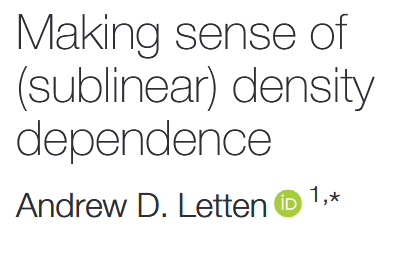
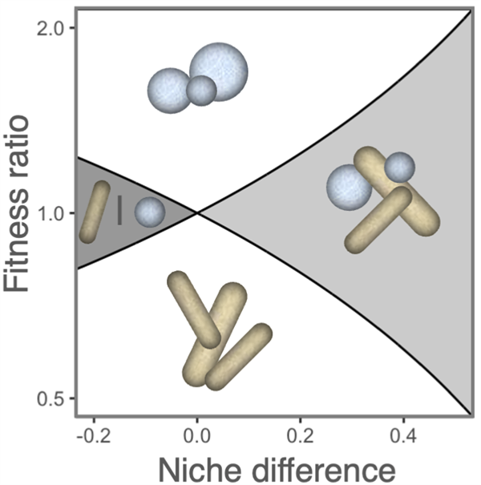

Welcome to the Letten Lab at the University of Queensland. Our research broadly aims to increase fundamental understanding of microbial population dynamics and evolution, and to bring this knowledge to bear on problems of environmental and human health. We tackle this through a close integration of experiments, mathematical modelling and statistical learning. Our backgrounds span ecology, evolution, microbiology, bioinformatics, biochemistry, computer science, and mathematics.

Current research in the group primarily orbits around three core research problems/gaps:  

1) Understanding how trade-offs in bacterial competitive fitness interact with environmental variability to mediate the evolution of antibiotic resistance.

2) Understanding the role of nonequilibrium dynamics in regulating microbial community assembly.

3) Understanding the shape of density dependence, from populations to ecosystems.

-----------------------

#### Recent work

::: {.grid .paper-grid}

::: {.g-col-12 .g-col-sm-6 .g-col-lg-4 .paper-card}

Orr et al. (2026) [Growth-density inversion in *Escherichia coli* reveals superlinear, not sublinear, density dependence](https://journals.plos.org/plosbiology/article?id=10.1371/journal.pbio.3003898), *PLoS Biology*.
:::

::: {.g-col-12 .g-col-sm-6 .g-col-lg-4 .paper-card}

Bolourchi et al. (2025) [Evolution and evolvability of rifampicin resistance across the bacterial tree of life](https://www.pnas.org/doi/abs/10.1073/pnas.2424307122), *PNAS*, 122(31) e2424307122.
:::

::: {.g-col-12 .g-col-sm-6 .g-col-lg-4 .paper-card}

Letten. (2025) [Making sense of (sublinear) density dependence](https://www.cell.com/trends/ecology-evolution/abstract/S0169-5347(25)00133-8), *Trends in Ecology & Evolution*, 40(7) 622-625.
:::

::: {.g-col-12 .g-col-sm-6 .g-col-lg-4 .paper-card}

Richardson, Engelstädter and Letten. (2025) [A unifying principle for multispecies coexistence under resource fluctuations](https://www.pnas.org/doi/abs/10.1073/pnas.2424996122), *PNAS*, 122(24) e2424996122.
:::

::: {.g-col-12 .g-col-sm-6 .g-col-lg-4 .paper-card}

Orr, Armitage and Letten. (2025) [Coexistence theory for microbial ecology, and vice versa](https://doi.org/10.1111/1462-2920.70072), *Environmental Microbiology*, 27(3) e70072.
:::

::: {.g-col-12 .g-col-sm-6 .g-col-lg-4 .paper-card}

Letten et al. (2024) [Microbial Dormancy Supports Multi-Species Coexistence Under Resource Fluctuations](https://onlinelibrary.wiley.com/doi/abs/10.1111/ele.14507), *Ecology Letters*, 27(9) e14507.
:::

:::

[See all publications](publications.qmd)